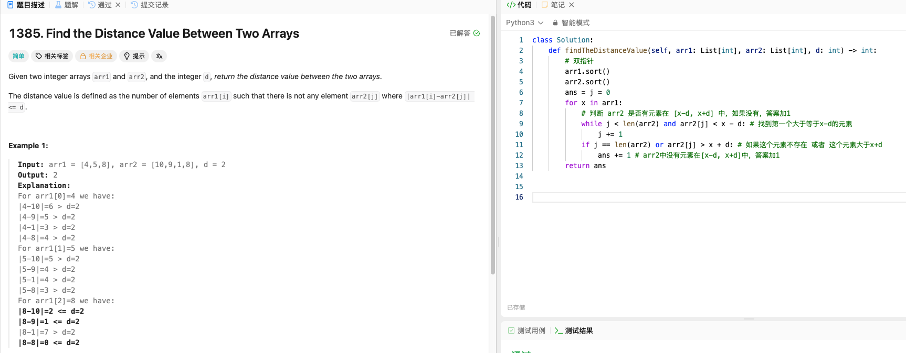

# LeetCode 1385 - Find the Distance Value Between Two Arrays

**Date:** 2026-01-09  
**Difficulty:** Easy  
**Tags:** Two Pointers, Sorting  
## Problem Screenshot

## Reflection  
遍历'arr1', 设 $x = arr1$, 找arr2是否有元素在[x-d,x+d]中，如果没有答案加1  

**双指针：**  
- 先排序  
- 用双指针找到第一个>x-d的元素  
- 如果这个元素不存在(j == len(arr2) ) 或者这个元素大于 x+d, 说明arr2中没有元素在[x-d, x+d]，答案+1  

**时间复杂度:**  
- O(nlogn+mlogm)，其中 n 是 arr 1的长度，m 是 arr2的长度  
- 排序：nlogn+mlogm， 双指针：m+n

